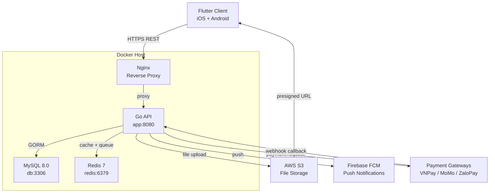
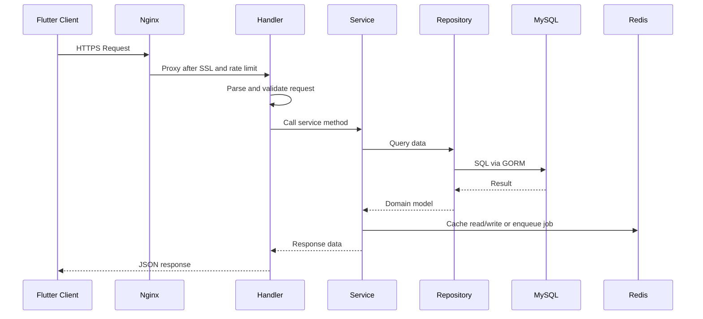
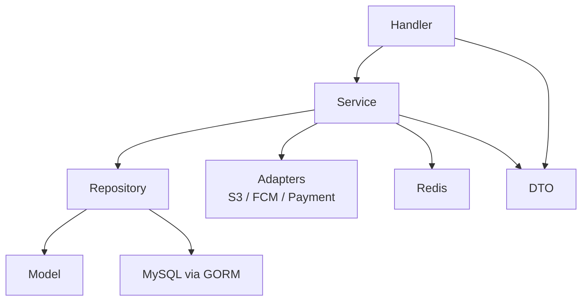
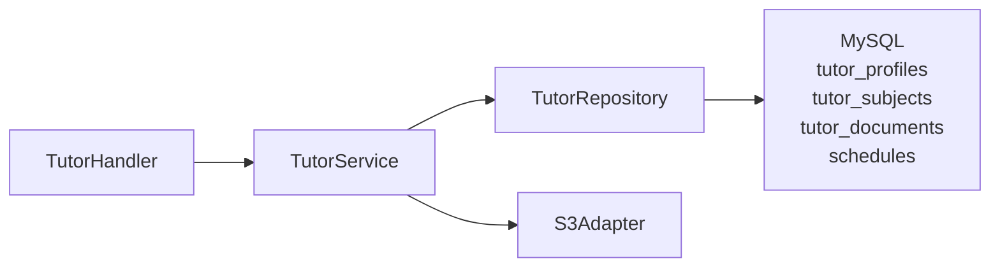
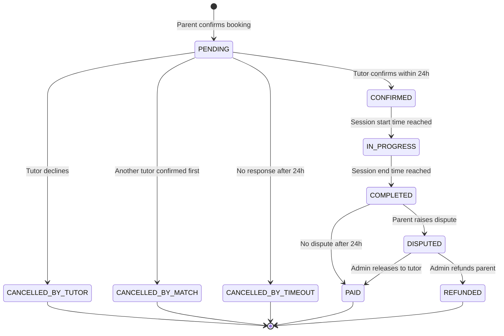
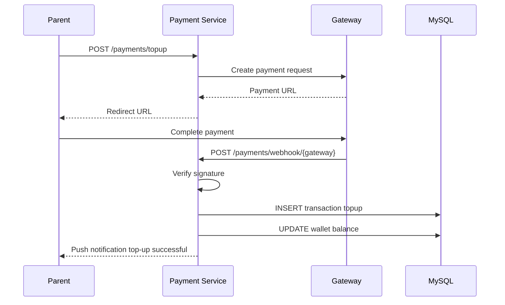
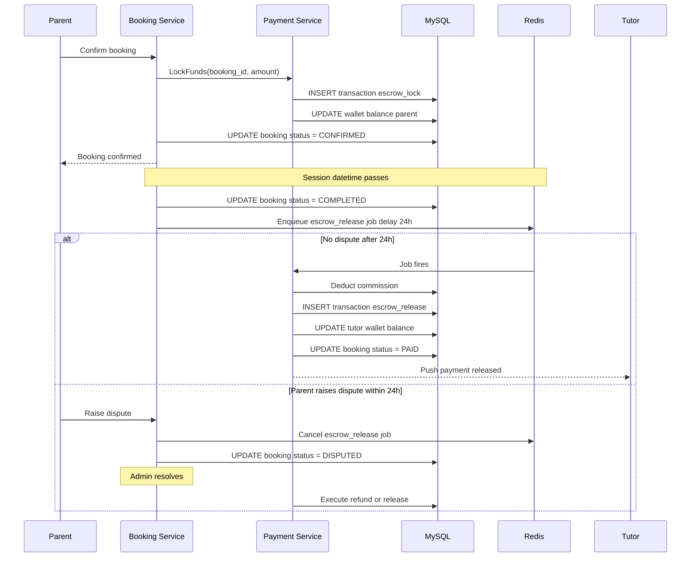
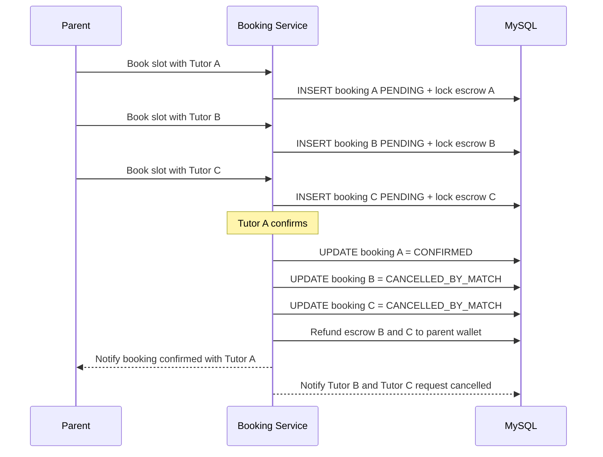
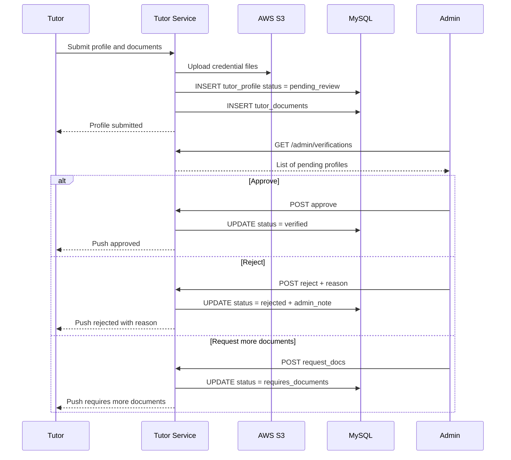

# System Architecture Document
# Tutor Matching Platform

**Version:** 1.0
**Status:** Draft
**Last Updated:** 2026-05-28

---

## 1. Overview

The system is a mobile-first platform with a Flutter frontend communicating
with a Golang REST API backend. All services run in Docker containers managed
via Docker Compose. Storage is split between MySQL (relational data) and AWS
S3 (file uploads). Push notifications are delivered via Firebase Cloud
Messaging. Payments are handled through third-party Vietnamese payment
gateways (VNPay, MoMo, ZaloPay).

---

## 2. High-Level Architecture



---

## 3. Request Lifecycle



---

## 4. Feature Module Structure

Every feature follows the same internal structure. The dependency direction
is strict — outer layers never import inner layers in reverse.



### Layer responsibilities

| Layer | Responsibility |
|---|---|
| Model | Domain structs, GORM mapping, enum types, relationship definitions |
| Repository | All DB queries — CRUD, filters, pagination, joins, transactions |
| Service | Business logic, workflows, domain rules, orchestration between repositories |
| Handler | HTTP only — parse request, call service, format response, map status codes |
| DTO | Request and response structs, validation tags, API contracts |
| Errors | Sentinel errors and domain-specific failure constants |
| Helpers | Reusable internal utilities — filename generators, mapping helpers |
| Adapters | External integrations — S3, FCM, payment gateways |
| Routes | Route registration, middleware attachment, route groups |
| Module | Dependency wiring — construct repository, service, handler |

### Rules

- Handler **never** touches GORM or writes SQL
- Repository **never** contains business rules or permission checks
- Service **never** reads `gin.Context` or writes HTTP responses
- DTOs are **not** domain models — they represent the API contract only
- Adapters are consumed by the service layer, not by handlers

---

## 5. Folder Structure

```
/cmd
  /api
    main.go

/internal

  /auth
    model.go
    repository.go
    service.go
    handler.go
    dto.go
    errors.go
    routes.go
    module.go

  /tutor
    model.go
    repository.go
    service.go
    handler.go
    dto.go
    errors.go
    helpers.go
    routes.go
    module.go

  /booking
    model.go
    repository.go
    service.go
    handler.go
    dto.go
    errors.go
    routes.go
    module.go

  /material
    model.go
    repository.go
    service.go
    handler.go
    dto.go
    errors.go
    routes.go
    module.go

  /payment
    model.go
    repository.go
    service.go
    handler.go
    dto.go
    errors.go
    routes.go
    module.go

  /notification
    service.go
    errors.go
    module.go

  /admin
    repository.go
    service.go
    handler.go
    dto.go
    routes.go
    module.go

  /middleware
    auth.go
    ratelimit.go
    logger.go

  /config
    config.go

/pkg
  /jwt
    jwt.go
  /s3
    uploader.go
  /fcm
    fcm.go
  /payment
    vnpay.go
    momo.go
    zalopay.go

/migrations
  001_init.sql

docker-compose.yml
Dockerfile
.env.example
```

---

## 6. Feature Modules

### 6.1 auth

Handles registration, login (phone + password), token issuance and refresh.

| File | Contents |
|---|---|
| `model.go` | `User` struct (incl. `PasswordHash`), role enum, status enum |
| `repository.go` | `FindByPhone`, `FindByEmail`, `FindByID`, `Create`, `UpdateStatus` |
| `service.go` | Register flow, bcrypt password hashing/verification, JWT issuance, token refresh |
| `handler.go` | `POST /auth/register`, `POST /auth/login`, `POST /auth/refresh` |
| `dto.go` | `RegisterRequest`, `LoginRequest`, `TokenResponse` |
| `errors.go` | `ErrPhoneAlreadyExists`, `ErrInvalidCredentials`, `ErrAccountSuspended` |
| `routes.go` | Mount public auth routes (no JWT middleware) |
| `module.go` | Wire `UserRepository` → `AuthService` → `AuthHandler` |

---

### 6.2 tutor

Manages tutor profile, subjects, credentials, schedule, and availability toggle.

| File | Contents |
|---|---|
| `model.go` | `TutorProfile`, `TutorSubject`, `TutorDocument`, `Schedule`, verification status enum |
| `repository.go` | `FindByUserID`, `Search` (with subject/level/slot filters), `UpdateVerificationStatus`, `UpsertSubjects`, `FindScheduleSlots` |
| `service.go` | Onboarding flow, credential upload, toggle accepting, search logic, admin approval |
| `handler.go` | `POST /tutors`, `GET /tutors/search`, `GET /tutors/:id`, `PATCH /tutors/me`, `POST /tutors/me/documents`, `PATCH /tutors/me/accepting` |
| `dto.go` | `CreateTutorRequest`, `TutorSearchQuery`, `TutorProfileResponse`, `SubjectInput` |
| `errors.go` | `ErrTutorNotFound`, `ErrAlreadyVerified`, `ErrDocumentTooLarge` |
| `helpers.go` | `GenerateDocumentFilename`, `BuildS3Key` |
| `routes.go` | Mount tutor routes with JWT middleware |
| `module.go` | Wire repository → service → handler; inject S3 adapter |



---

### 6.3 booking

Manages the full booking lifecycle including concurrent request handling,
state transitions, and cancellation policy enforcement.

| File | Contents |
|---|---|
| `model.go` | `Booking`, status enum with all cancel subtypes |
| `repository.go` | `Create`, `FindByID`, `FindPendingBySlot`, `UpdateStatus`, `FindByTutorID`, `FindByParentID` |
| `service.go` | Create booking + escrow lock, confirm/decline, auto-cancel concurrent requests, timeout job enqueue, cancellation policy |
| `handler.go` | `POST /bookings`, `PATCH /bookings/:id/confirm`, `PATCH /bookings/:id/decline`, `PATCH /bookings/:id/cancel`, `GET /bookings` |
| `dto.go` | `CreateBookingRequest`, `BookingResponse`, `CancelRequest` |
| `errors.go` | `ErrSlotUnavailable`, `ErrBookingNotFound`, `ErrInsufficientBalance`, `ErrCancelWindowExpired` |
| `routes.go` | Mount booking routes with JWT middleware |
| `module.go` | Wire repository → service → handler; inject escrow service, notification service, Redis |



---

### 6.4 payment

Manages wallet top-up, escrow lock/release, withdrawals, and payment gateway
webhook processing.

| File | Contents |
|---|---|
| `model.go` | `Wallet`, `Transaction`, transaction type enum |
| `repository.go` | `FindWalletByUserID`, `UpdateBalance`, `CreateTransaction`, `FindTransactionsByUserID` |
| `service.go` | Top-up initiation, webhook validation, escrow lock, escrow release with commission deduction, refund, withdrawal request |
| `handler.go` | `POST /payments/topup`, `GET /payments/wallet`, `GET /payments/transactions`, `POST /payments/withdraw`, `POST /payments/webhook/vnpay`, `POST /payments/webhook/momo`, `POST /payments/webhook/zalopay` |
| `dto.go` | `TopupRequest`, `WithdrawRequest`, `WalletResponse`, `TransactionResponse` |
| `errors.go` | `ErrInsufficientBalance`, `ErrInvalidWebhookSignature`, `ErrDuplicateTransaction` |
| `routes.go` | Mount payment routes; webhook endpoints are public (no JWT), wallet endpoints require JWT |
| `module.go` | Wire repository → service → handler; inject VNPay, MoMo, ZaloPay adapters |



---

### 6.5 material

Manages lesson uploads and assignment creation by tutors, and file access
and submission by students.

| File | Contents |
|---|---|
| `model.go` | `Material`, `Submission`, material type enum, submission status enum |
| `repository.go` | `Create`, `FindByStudentID`, `FindByBookingID`, `CreateSubmission`, `FindSubmissionsByAssignmentID` |
| `service.go` | Upload material to S3, create assignment with deadline, student submission, overdue detection |
| `handler.go` | `POST /materials`, `GET /materials`, `GET /materials/:id`, `POST /materials/:id/submit` |
| `dto.go` | `CreateMaterialRequest`, `MaterialResponse`, `SubmissionResponse` |
| `errors.go` | `ErrMaterialNotFound`, `ErrAssignmentNotFound`, `ErrFileTooLarge` |
| `helpers.go` | `GenerateMaterialFilename`, `IsOverdue` |
| `routes.go` | Mount material routes with JWT middleware |
| `module.go` | Wire repository → service → handler; inject S3 adapter, notification service |

---

### 6.6 notification

Internal service only — no HTTP handler or routes. Called by other services
to send push notifications via FCM.

| File | Contents |
|---|---|
| `service.go` | `SendToUser`, `SendToMultiple`, `SendBookingConfirmed`, `SendAssignmentSubmitted`, `SendPaymentReleased`, etc. |
| `errors.go` | `ErrFCMDeliveryFailed`, `ErrInvalidDeviceToken` |
| `module.go` | Wire FCM adapter → NotificationService |

All other services receive `NotificationService` as a dependency via their
module wiring. No feature calls FCM directly.

---

### 6.7 admin

Operations for the internal admin panel: verification queue, user management,
dispute resolution, dashboard metrics.

| File | Contents |
|---|---|
| `repository.go` | `FindPendingVerifications`, `FindUserByID`, `FindDisputedBookings`, `GetDashboardMetrics` |
| `service.go` | Approve/reject tutor, suspend/unsuspend user, resolve dispute with escrow decision |
| `handler.go` | `GET /admin/verifications`, `POST /admin/verifications/:id/approve`, `POST /admin/verifications/:id/reject`, `GET /admin/users`, `PATCH /admin/users/:id/suspend`, `GET /admin/disputes`, `POST /admin/disputes/:id/resolve`, `GET /admin/dashboard` |
| `dto.go` | `VerificationDecisionRequest`, `DisputeResolutionRequest`, `DashboardResponse` |
| `routes.go` | Mount admin routes with JWT middleware + admin role check |
| `module.go` | Wire repository → service → handler; inject payment service, notification service |

---

## 7. Escrow Flow



---

## 8. Concurrent Booking Flow



---

## 9. Tutor Verification Flow



---

## 10. Docker Setup

### docker-compose.yml

```yaml
version: "3.9"

services:

  nginx:
    image: nginx:1.25-alpine
    ports:
      - "80:80"
      - "443:443"
    volumes:
      - ./nginx/nginx.conf:/etc/nginx/nginx.conf
      - ./nginx/certs:/etc/nginx/certs
    depends_on:
      - app
    restart: unless-stopped

  app:
    build:
      context: .
      dockerfile: Dockerfile
    env_file: .env
    depends_on:
      db:
        condition: service_healthy
      redis:
        condition: service_healthy
    restart: unless-stopped

  db:
    image: mysql:8.0
    environment:
      MYSQL_ROOT_PASSWORD: ${DB_ROOT_PASSWORD}
      MYSQL_DATABASE: ${DB_NAME}
      MYSQL_USER: ${DB_USER}
      MYSQL_PASSWORD: ${DB_PASSWORD}
    volumes:
      - mysql_data:/var/lib/mysql
      - ./migrations/001_init.sql:/docker-entrypoint-initdb.d/init.sql
    healthcheck:
      test: ["CMD", "mysqladmin", "ping", "-h", "localhost"]
      interval: 10s
      timeout: 5s
      retries: 5
    restart: unless-stopped

  redis:
    image: redis:7-alpine
    command: redis-server --appendonly yes
    volumes:
      - redis_data:/data
    healthcheck:
      test: ["CMD", "redis-cli", "ping"]
      interval: 10s
      timeout: 5s
      retries: 5
    restart: unless-stopped

volumes:
  mysql_data:
  redis_data:
```

### Dockerfile

```dockerfile
FROM golang:1.22-alpine AS builder
WORKDIR /app
COPY go.mod go.sum ./
RUN go mod download
COPY . .
RUN go build -o server ./cmd/api

FROM alpine:3.19
WORKDIR /app
COPY --from=builder /app/server .
EXPOSE 8080
CMD ["./server"]
```

### Environment Variables

```bash
# App
APP_ENV=production
APP_PORT=8080

# Database
DB_HOST=db
DB_PORT=3306
DB_NAME=tutor_platform
DB_USER=app_user
DB_PASSWORD=
DB_ROOT_PASSWORD=

# Redis
REDIS_HOST=redis
REDIS_PORT=6379

# JWT
JWT_SECRET=
JWT_ACCESS_TTL=15m
JWT_REFRESH_TTL=7d

# AWS S3
AWS_ACCESS_KEY_ID=
AWS_SECRET_ACCESS_KEY=
AWS_REGION=ap-southeast-1
AWS_BUCKET=tutor-platform

# FCM
FCM_SERVER_KEY=

# VNPay
VNPAY_TMN_CODE=
VNPAY_HASH_SECRET=
VNPAY_URL=https://sandbox.vnpayment.vn/paymentv2/vpcpay.html

# MoMo
MOMO_PARTNER_CODE=
MOMO_ACCESS_KEY=
MOMO_SECRET_KEY=
MOMO_URL=https://test-payment.momo.vn/v2/gateway/api/create

# ZaloPay
ZALOPAY_APP_ID=
ZALOPAY_KEY1=
ZALOPAY_KEY2=
ZALOPAY_URL=https://sb-openapi.zalopay.vn/v2/create

# Platform
PLATFORM_COMMISSION_RATE=0.12
ESCROW_RELEASE_DELAY_HOURS=24
BOOKING_TIMEOUT_HOURS=24
MAX_CONCURRENT_REQUESTS=3
```

---

## 11. Database Schema (MySQL)

```sql
CREATE TABLE users (
  id          BIGINT UNSIGNED AUTO_INCREMENT PRIMARY KEY,
  role        ENUM('tutor','parent','student','admin') NOT NULL,
  name          VARCHAR(255) NOT NULL,
  phone         VARCHAR(20),                       -- not unique; UNIQUE dropped in migration 003
  email         VARCHAR(255) UNIQUE,
  password_hash VARCHAR(255) NOT NULL DEFAULT '',  -- bcrypt; added in migration 002
  auth_provider ENUM('password','google') NOT NULL DEFAULT 'password', -- migration 005
  google_sub    VARCHAR(255) UNIQUE,               -- Google ID-token "sub"; NULL for password accounts; migration 005
  avatar_url    VARCHAR(500),
  status      ENUM('active','suspended') NOT NULL DEFAULT 'active',
  created_at  DATETIME NOT NULL DEFAULT CURRENT_TIMESTAMP,
  updated_at  DATETIME NOT NULL DEFAULT CURRENT_TIMESTAMP ON UPDATE CURRENT_TIMESTAMP
) ENGINE=InnoDB DEFAULT CHARSET=utf8mb4;

CREATE TABLE tutor_profiles (
  id                  BIGINT UNSIGNED AUTO_INCREMENT PRIMARY KEY,
  user_id             BIGINT UNSIGNED NOT NULL UNIQUE,
  hourly_rate         DECIMAL(10,0) NOT NULL,
  bio                 TEXT,
  is_accepting        BOOLEAN NOT NULL DEFAULT TRUE,
  verification_status ENUM('pending_review','requires_documents',
                           'verified','rejected') NOT NULL DEFAULT 'pending_review',
  rating_avg          DECIMAL(3,2) NOT NULL DEFAULT 0.00,
  rating_count        INT UNSIGNED NOT NULL DEFAULT 0,
  created_at          DATETIME NOT NULL DEFAULT CURRENT_TIMESTAMP,
  updated_at          DATETIME NOT NULL DEFAULT CURRENT_TIMESTAMP ON UPDATE CURRENT_TIMESTAMP,
  FOREIGN KEY (user_id) REFERENCES users(id)
) ENGINE=InnoDB DEFAULT CHARSET=utf8mb4;

CREATE TABLE tutor_subjects (
  id       BIGINT UNSIGNED AUTO_INCREMENT PRIMARY KEY,
  tutor_id BIGINT UNSIGNED NOT NULL,
  subject  VARCHAR(100) NOT NULL,
  level    ENUM('primary','middle_school','high_school','university') NOT NULL,
  FOREIGN KEY (tutor_id) REFERENCES tutor_profiles(id),
  UNIQUE KEY uq_tutor_subject_level (tutor_id, subject, level)
) ENGINE=InnoDB DEFAULT CHARSET=utf8mb4;

CREATE TABLE tutor_documents (
  id          BIGINT UNSIGNED AUTO_INCREMENT PRIMARY KEY,
  tutor_id    BIGINT UNSIGNED NOT NULL,
  doc_type    ENUM('degree','certificate','national_id') NOT NULL,
  file_url    VARCHAR(500) NOT NULL,
  uploaded_at DATETIME NOT NULL DEFAULT CURRENT_TIMESTAMP,
  verified_at DATETIME,
  admin_note  TEXT,
  FOREIGN KEY (tutor_id) REFERENCES tutor_profiles(id)
) ENGINE=InnoDB DEFAULT CHARSET=utf8mb4;

CREATE TABLE schedules (
  id           BIGINT UNSIGNED AUTO_INCREMENT PRIMARY KEY,
  tutor_id     BIGINT UNSIGNED NOT NULL,
  day_of_week  TINYINT NOT NULL COMMENT '0=Sunday 6=Saturday',
  start_time   TIME NOT NULL,
  end_time     TIME NOT NULL,
  is_available BOOLEAN NOT NULL DEFAULT TRUE,
  FOREIGN KEY (tutor_id) REFERENCES tutor_profiles(id)
) ENGINE=InnoDB DEFAULT CHARSET=utf8mb4;

CREATE TABLE students (
  id                BIGINT UNSIGNED AUTO_INCREMENT PRIMARY KEY,
  parent_id         BIGINT UNSIGNED NOT NULL,
  name              VARCHAR(255) NOT NULL,
  grade             VARCHAR(50),
  school            VARCHAR(255),                                  -- added in migration 004
  status            ENUM('pending','connected') NOT NULL DEFAULT 'pending', -- migration 004
  user_id           BIGINT UNSIGNED NULL,                          -- child's own account once connected; migration 004
  invite_code       VARCHAR(20) NULL,                              -- shareable connect code while pending; migration 004
  invite_expires_at DATETIME NULL,                                 -- migration 004
  created_at        DATETIME NOT NULL DEFAULT CURRENT_TIMESTAMP,
  updated_at        DATETIME NOT NULL DEFAULT CURRENT_TIMESTAMP ON UPDATE CURRENT_TIMESTAMP, -- migration 004
  INDEX idx_students_invite_code (invite_code),                    -- migration 004
  FOREIGN KEY (parent_id) REFERENCES users(id),
  FOREIGN KEY (user_id)   REFERENCES users(id)                     -- migration 004
) ENGINE=InnoDB DEFAULT CHARSET=utf8mb4;

CREATE TABLE bookings (
  id            BIGINT UNSIGNED AUTO_INCREMENT PRIMARY KEY,
  tutor_id      BIGINT UNSIGNED NOT NULL,
  student_id    BIGINT UNSIGNED NOT NULL,
  parent_id     BIGINT UNSIGNED NOT NULL,
  subject       VARCHAR(100) NOT NULL,
  level         ENUM('primary','middle_school','high_school','university') NOT NULL,
  slot_datetime DATETIME NOT NULL,
  duration_mins SMALLINT UNSIGNED NOT NULL DEFAULT 60,
  status        ENUM('pending','confirmed','in_progress','completed',
                     'paid','disputed','refunded',
                     'cancelled_by_tutor','cancelled_by_parent',
                     'cancelled_by_match','cancelled_by_timeout')
                NOT NULL DEFAULT 'pending',
  amount        DECIMAL(12,0) NOT NULL,
  platform_fee  DECIMAL(12,0),
  created_at    DATETIME NOT NULL DEFAULT CURRENT_TIMESTAMP,
  updated_at    DATETIME NOT NULL DEFAULT CURRENT_TIMESTAMP ON UPDATE CURRENT_TIMESTAMP,
  FOREIGN KEY (tutor_id)   REFERENCES tutor_profiles(id),
  FOREIGN KEY (student_id) REFERENCES students(id),
  FOREIGN KEY (parent_id)  REFERENCES users(id),
  INDEX idx_tutor_status  (tutor_id, status),
  INDEX idx_parent_status (parent_id, status),
  INDEX idx_slot_datetime (slot_datetime)
) ENGINE=InnoDB DEFAULT CHARSET=utf8mb4;

CREATE TABLE materials (
  id         BIGINT UNSIGNED AUTO_INCREMENT PRIMARY KEY,
  tutor_id   BIGINT UNSIGNED NOT NULL,
  student_id BIGINT UNSIGNED NOT NULL,
  booking_id BIGINT UNSIGNED,
  type       ENUM('slide','note','assignment') NOT NULL,
  file_url   VARCHAR(500),
  title      VARCHAR(255) NOT NULL,
  deadline   DATETIME,
  created_at DATETIME NOT NULL DEFAULT CURRENT_TIMESTAMP,
  FOREIGN KEY (tutor_id)   REFERENCES tutor_profiles(id),
  FOREIGN KEY (student_id) REFERENCES students(id),
  FOREIGN KEY (booking_id) REFERENCES bookings(id)
) ENGINE=InnoDB DEFAULT CHARSET=utf8mb4;

CREATE TABLE submissions (
  id            BIGINT UNSIGNED AUTO_INCREMENT PRIMARY KEY,
  assignment_id BIGINT UNSIGNED NOT NULL,
  student_id    BIGINT UNSIGNED NOT NULL,
  file_url      VARCHAR(500) NOT NULL,
  submitted_at  DATETIME NOT NULL DEFAULT CURRENT_TIMESTAMP,
  status        ENUM('submitted','overdue') NOT NULL DEFAULT 'submitted',
  FOREIGN KEY (assignment_id) REFERENCES materials(id),
  FOREIGN KEY (student_id)    REFERENCES students(id)
) ENGINE=InnoDB DEFAULT CHARSET=utf8mb4;

CREATE TABLE wallets (
  id         BIGINT UNSIGNED AUTO_INCREMENT PRIMARY KEY,
  user_id    BIGINT UNSIGNED NOT NULL UNIQUE,
  balance    DECIMAL(14,0) NOT NULL DEFAULT 0,
  updated_at DATETIME NOT NULL DEFAULT CURRENT_TIMESTAMP ON UPDATE CURRENT_TIMESTAMP,
  FOREIGN KEY (user_id) REFERENCES users(id)
) ENGINE=InnoDB DEFAULT CHARSET=utf8mb4;

CREATE TABLE transactions (
  id             BIGINT UNSIGNED AUTO_INCREMENT PRIMARY KEY,
  user_id        BIGINT UNSIGNED NOT NULL,
  type           ENUM('topup','escrow_lock','escrow_release',
                      'refund','withdrawal') NOT NULL,
  amount         DECIMAL(12,0) NOT NULL,
  ref_booking_id BIGINT UNSIGNED,
  gateway        VARCHAR(50),
  gateway_ref    VARCHAR(255),
  created_at     DATETIME NOT NULL DEFAULT CURRENT_TIMESTAMP,
  FOREIGN KEY (user_id)        REFERENCES users(id),
  FOREIGN KEY (ref_booking_id) REFERENCES bookings(id),
  INDEX idx_user_type (user_id, type)
) ENGINE=InnoDB DEFAULT CHARSET=utf8mb4;

CREATE TABLE reviews (
  id         BIGINT UNSIGNED AUTO_INCREMENT PRIMARY KEY,
  booking_id BIGINT UNSIGNED NOT NULL UNIQUE,
  parent_id  BIGINT UNSIGNED NOT NULL,
  tutor_id   BIGINT UNSIGNED NOT NULL,
  rating     TINYINT UNSIGNED NOT NULL,
  comment    TEXT,
  created_at DATETIME NOT NULL DEFAULT CURRENT_TIMESTAMP,
  FOREIGN KEY (booking_id) REFERENCES bookings(id),
  FOREIGN KEY (parent_id)  REFERENCES users(id),
  FOREIGN KEY (tutor_id)   REFERENCES tutor_profiles(id)
) ENGINE=InnoDB DEFAULT CHARSET=utf8mb4;
```

---

## 12. Non-Functional Requirements

| Area | Requirement |
|---|---|
| Auth | JWT + refresh token, access token expiry 15 minutes |
| File upload | 20MB max per file, PDF / JPG / PNG / DOCX only |
| Push notifications | Firebase Cloud Messaging (FCM) |
| Storage | AWS S3, ap-southeast-1 region |
| API versioning | All endpoints under /api/v1/ |
| Rate limiting | Nginx-level on upload and search endpoints |
| Timezone | Stored UTC, displayed Asia/Ho_Chi_Minh |
| Concurrency | Pessimistic lock on schedule slot at booking confirmation |
| Charset | utf8mb4 throughout MySQL for Vietnamese character support |
```